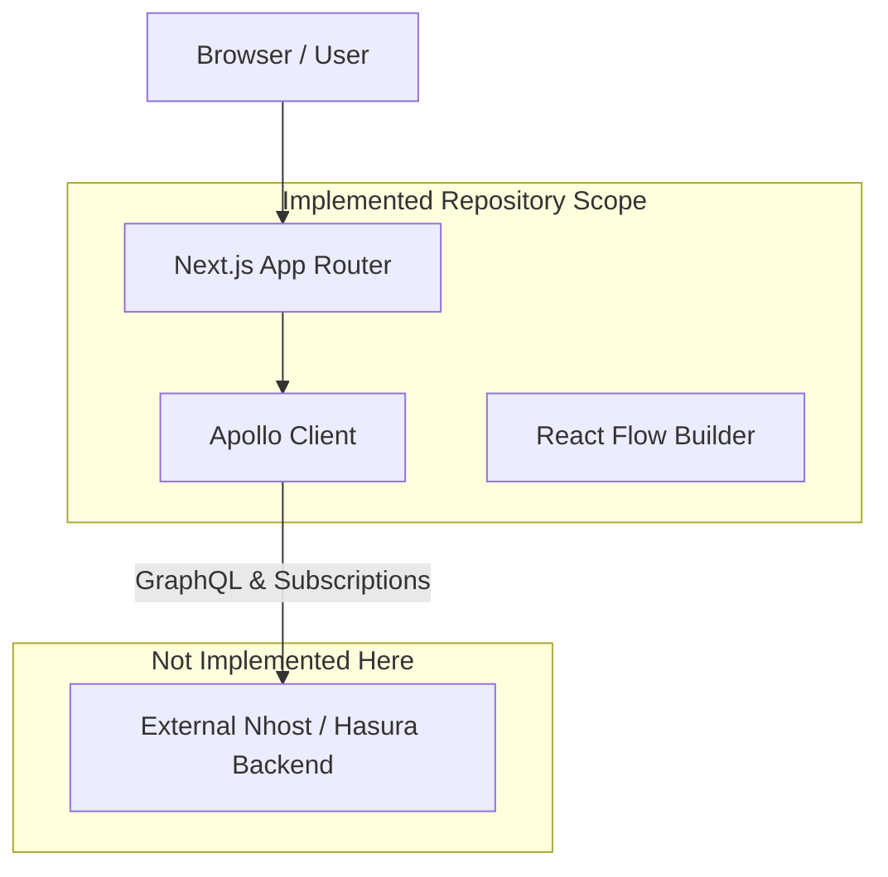

# Orqen

Orqen is a multi-tenant AI workflow orchestration platform frontend that lets users visually build workflows from AI, HTTP, conditional, approval, database, and notification steps. It provides a polished React Flow interface for designing agentic pipelines and connects to a secure GraphQL backend for execution and real-time monitoring.

## 1. Features

**Implemented Features:**
- Visual workflow builder
- React Flow-based workflow editor
- Nhost authentication integration (Next.js provider)
- UI for configuring:
  - AI/LLM steps
  - HTTP request steps
  - Conditional branching
  - Approval gates
  - Database writes
  - Notifications
- Manual execution UI (trigger form)
- Webhook execution UI
- Real-time execution monitoring UI elements (GraphQL subscriptions integrated via Apollo)
- Organization isolation UI context
- Owner/editor/viewer role-based UI toggles (frontend UX gating)

**Not Implemented in this Repository (Backend / Infrastructure):**
- Real backend workflow execution engine (Nhost Functions)
- Actual Nhost/Hasura backend configuration (Migrations, Metadata, Event Triggers, Hasura Actions)
- Server-side LLM, HTTP, Database write logic
- Actual scheduled/database triggers

## 2. Architecture



The architecture implemented in this repository represents the presentation and state management layer (Next.js). It uses Apollo Client to connect to a compliant Nhost backend (which must be configured separately as it is not included in this codebase).

## 3. Tech Stack

| Layer | Technology |
|---|---|
| Frontend | Next.js |
| UI | React + Tailwind CSS + shadcn/ui |
| Workflow Editor | React Flow |
| API | GraphQL |
| Authentication | Nhost Auth (@nhost/nextjs) |

## 4. Repository Structure

```text
src/
  app/                    # Next.js App Router pages and layouts
  components/
    layout/               # Shell, Topbar, Sidebar, Org Switcher
    ui/                   # shadcn/ui components
    workflow/             # React Flow nodes, canvas, and palettes
  hooks/                  # Custom hooks for Nhost/Apollo interactions
  lib/
    auth/                 # Organization and user context providers
    graphql/              # GraphQL queries and mutations
    workflow/             # Workflow node catalog and converters
  types/                  # TypeScript interfaces
```

## 5. Core Data Model

*Note: The actual database schema migrations and Hasura metadata do not exist in this repository. The frontend expects the following structure based on its TypeScript definitions (`src/types/`):*

- `organizations`: Multi-tenant groupings.
- `org_members`: Links users to organizations with roles.
- `workflows`: Base table for user-created workflow graphs.
- `workflow_steps`: Individual nodes within a workflow.
- `workflow_runs`: Execution records of workflows.

## 6. Workflow Step Types

### LLM Call
**Purpose:** Invoke an AI model (e.g., Gemini) with system and user prompts.
**Configuration:** Provider, Model, System/User Prompts, Temperature.
**Execution behavior:** *Not Implemented in backend.*

### HTTP Request
**Purpose:** Perform external API calls.
**Configuration:** Method, URL, Headers, Body, Retry count.
**Execution behavior:** *Not Implemented in backend.*

### Conditional Branch
**Purpose:** Route execution based on evaluated expressions.
**Supported operators:** standard equality/comparison.
**TRUE/FALSE routing:** Visually implemented via distinct React Flow handles.

### Approval Gate
**Purpose:** Pause workflow execution for human intervention.
**Pause behavior:** Frontend UI supports pausing.
**Resume behavior:** Frontend supports an `approveStep` mutation. *Actual pause/resume logic is Not Implemented in backend.*

### DB Write
**Purpose:** Write structured data to configured tables.
**What it writes:** Maps upstream payload to database schemas.

### Notify
**Purpose:** Send alerts (e.g., to Slack).
**How notification processing works:** Visually configured; *Backend dispatcher Not Implemented.*

## 7. Workflow Execution

**Expected Lifecycle (Frontend perspective):**
The UI attempts to invoke `triggerWorkflowRun` via GraphQL. The UI expects the backend to emit `step_runs` updates over GraphQL subscriptions (via `useWorkflowRunSubscription`).

Statuses supported by the frontend UI:
- **Workflow:** pending, running, paused, completed, failed
- **Step:** pending, running, paused, completed, failed, skipped

## 8. Approval Gate Architecture

*Note: The backend authorization and execution pauses are **Not Implemented**.*

**Frontend implementation:**
1. UI subscribes to run state and detects a `paused` step.
2. User is presented with Approve/Reject buttons.
3. User clicks Approve -> invokes `approveStep` GraphQL mutation.
4. Frontend relies on the backend to validate organization membership and roles before proceeding.

## 9. Security Model

**Frontend Implementation:**
Frontend components restrict actions (e.g., hiding the Run button or disabling configuration of DB Writes) based on the user's role (Owner, Editor, Viewer).

**Backend Layer (Not Implemented):**
The application relies on Hasura authorization filters and server-side functions to actually secure the data. *This backend logic does not exist in the current repository.*

## 10. Organization Isolation

The UI filters data by checking the active organization ID selected in the `OrgProvider`. 
*Note: Direct ID guessing protection and actual isolation must be enforced by the missing Hasura backend.*

## 11. Privileged Step Gating

The frontend enforces UX restrictions for owner-only features:
- DB Write
- Notify
- Webhook trigger

*Server-side validation is Not Implemented in this repository.*

## 12. GraphQL

The frontend defines the following operations in `src/lib/graphql/documents.ts`:

Queries:
- `WORKFLOW_LIST_QUERY`
- `WORKFLOW_DETAIL_QUERY`
- `RUN_LIST_QUERY`
- `RUN_DETAIL_QUERY`

Mutations:
- `START_RUN_MUTATION` (`triggerWorkflowRun`)
- `DECIDE_APPROVAL_MUTATION` (`approveStep`)

## 13. Real-Time Execution

**Architecture:**
The frontend utilizes `@apollo/client` and `graphql-ws` to subscribe to live updates. 
No polling is used for run progress.

## 14. Triggers

**Implemented in UI:**
- Manual (via "Run Workflow" modal)
- Webhook

**Webhook Configuration:**
Users can generate a webhook URL and secret. 
Example usage expected by the platform:
```bash
curl -X POST "<WEBHOOK_URL>" \
  -H "Content-Type: application/json" \
  -d '{
    "workflow_id": "<WORKFLOW_ID>",
    "secret": "<WEBHOOK_SECRET>",
    "input": {
      "customer": "Acme Corp",
      "message": "Customer wants an enterprise plan"
    }
  }'
```

## 15. Demo Workflow

The frontend is capable of rendering the **Customer Priority Analyzer** workflow:

```text
Trigger
↓
LLM
↓
HTTP
↓
Conditional
├── TRUE → Approval Gate
│            ↓
│          DB Write
│            ↓
│          Notify
│
└── FALSE → Notify
```

*Note: Execution of this demo is Not Verified because the execution backend is missing.*

## 16. Local Development Requirements

- Node.js
- npm
- (Optional) Nhost Cloud backend to connect the frontend to.

## 17. Installation

```bash
git clone <repository-url>
cd agentflow-designer
npm install
```

## 18. Environment Variables

Create a `.env.local` file:

```env
NEXT_PUBLIC_NHOST_SUBDOMAIN="local" # Your Nhost subdomain
NEXT_PUBLIC_NHOST_REGION=""         # Your Nhost region
```

## 19. Database / Hasura Setup

**Not Implemented.** The repository does not contain a `nhost/` directory, migrations, or Hasura metadata.

## 20. Authentication Setup

Authentication is handled via the `@nhost/nextjs` library. Users can sign in using the `/login` route, which delegates to the configured Nhost backend.

## 21. Running the Application

**Frontend:**
```bash
npm run dev
```
Then navigate to: `http://localhost:3000`

## 22. Testing

The following commands are available to validate the codebase:

- `npm run typecheck` - Validates TypeScript types and structure.
- `npm run lint` - Runs Next.js ESLint checks.
- `npm run build` - Validates that the Next.js App Router can statically and dynamically compile the application without errors.
- `npm run format` - Runs Prettier to format code.

## 23. Security Verification

**Verified:**
- Frontend compilation and static typing.
- Next.js layout and provider architecture (`NhostProvider`, `NhostApolloProvider`).

**Not Verified (Requires Backend):**
- Cross-organization workflow access
- Direct UUID access
- Viewer run restriction
- Editor privileged-step restriction
- Cross-organization approval
- Cross-organization workflow execution

## 24. E2E Demonstration

**Not Verified.** 
Because the execution engine (Nhost Functions) and Hasura backend are missing from the repository, a full end-to-end execution cannot be run locally. 

## 25. Deployment

**Frontend:**
The application can be deployed to Vercel or any Next.js compatible host.

1. Connect repository to Vercel.
2. Set `NEXT_PUBLIC_NHOST_SUBDOMAIN` and `NEXT_PUBLIC_NHOST_REGION`.
3. Deploy.

**Backend:**
Not applicable for this repository.

## 26. Production Considerations

This repository is purely a frontend web application. To become a production-grade system, a complete Nhost backend must be generated, implementing:
1. Hasura authorization policies.
2. A durable message queue and worker system (or serverless functions) for the workflow execution engine.

## 27. Assignment Requirements Mapping

| Requirement | Implementation |
|---|---|
| Multi-tenant organizations | Frontend context (`OrgProvider`) |
| Role-based access | Frontend UI gating |
| Workflow builder | React Flow UI |
| LLM call | Config UI only |
| HTTP request | Config UI only |
| DB write | Config UI only |
| Notify | Config UI only |
| Conditional branch | Config UI only |
| Approval gate | Config UI + `approveStep` mutation |
| Manual trigger | `triggerWorkflowRun` mutation |
| Webhook trigger | Config UI only |
| Real-time updates | GraphQL Subscriptions (`useWorkflowRunSubscription`) |
| Quota | UI usage meter |
| Cross-org isolation | **Not Implemented (Backend missing)** |

## 28. Security Architecture Summary

**Frontend permissions ≠ security boundary.** 

The current repository enforces restrictions in the React application (e.g., hiding buttons based on user role). However, actual security—including Hasura authorization, server-side Action/function validation, organization membership, and role checks—must be implemented in an external backend environment, which is currently absent from this codebase.
