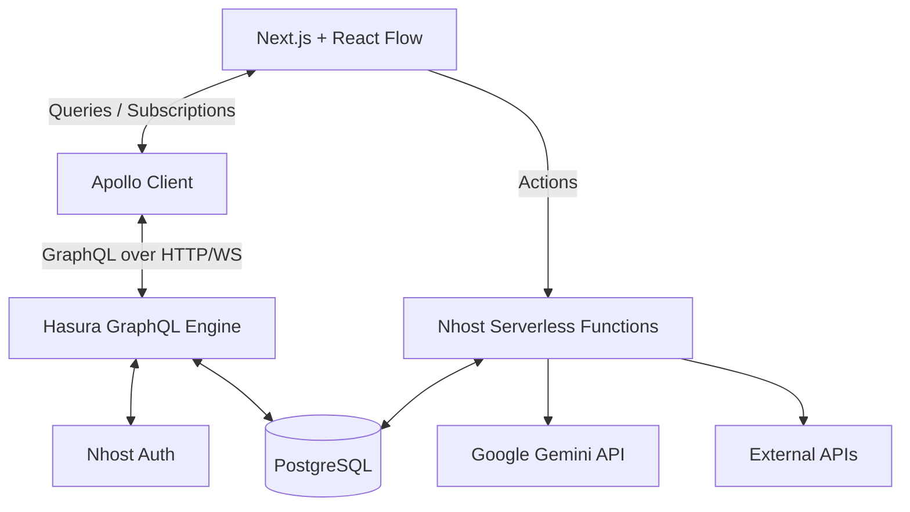

<div align="center">
  
</div>

<div align="center">

# Orqen

**AI Workflow Orchestration Platform**

Build, connect, execute, and monitor intelligent workflows.

</div>

---

## Project Introduction

Orqen is a full-stack AI workflow orchestration platform built to connect language models, external APIs, logical operators, and human approval gates into reliable, executable pipelines.

Instead of treating AI prompts as isolated operations, Orqen enables users to visually build intelligent workflows where the output of an LLM can be evaluated, passed to an external system via HTTP, written to a database, or paused for human review before continuing. Workflows are executed server-side via a resilient execution engine, with state persisted in PostgreSQL and streamed to the frontend via GraphQL subscriptions in real time.

---

## Key Features

- **Visual Workflow Builder:** React Flow-powered drag-and-drop editor for composing node-based workflows.
- **Server-Side Execution Engine:** Secure, stateful workflow execution handled via serverless functions.
- **AI/LLM Execution:** Deep integration with Google Gemini for structured AI operations.
- **HTTP Requests:** First-class support for external API interactions within a workflow.
- **Conditional Branching:** Dynamic path routing based on previous step outputs.
- **Human-in-the-Loop:** Approval gates that securely pause execution until authorized by an Editor or Owner.
- **Database Writes:** Persist workflow outputs directly to the application database.
- **Real-time Monitoring:** Hasura GraphQL subscriptions push live execution updates to the UI without polling.
- **Multi-Organization Architecture:** Secure logical isolation of workflows, runs, and members by organization.
- **Role-Based Access Control (RBAC):** Owner, Editor, and Viewer permissions enforced at the database (RLS) and server level.
- **Nhost Authentication:** Complete authentication flow, including sign up, login, and password reset.

---

## Product Workflow

Orqen models business logic as a directed acyclic graph (DAG). The visual builder constructs the workflow, while the backend engine traverses and executes it.

```mermaid
graph TD
    Trigger((Manual Trigger)) --> LLM[LLM Call: Gemini]
    LLM --> Branch{Conditional}

    Branch -- priority == "HIGH" --> HTTP[HTTP Request: PagerDuty]
    Branch -- priority != "HIGH" --> DB[DB Write: Save Log]

    HTTP --> Approval[Approval Gate]
    Approval --> Notify[Notify: Slack]
```

---

## Architecture

Orqen employs a modern, serverless, GraphQL-first architecture.



### Security Layers

1. **Frontend:** Protects routes and provides role-aware UI elements.
2. **Hasura (Database):** Enforces Row-Level Security (RLS) using session variables (`x-hasura-org-id`, `x-hasura-role`), ensuring users can only query data within their organization.
3. **Nhost Functions (Execution):** Independently validates the user's role and organization membership before executing privileged operations like triggering a workflow or approving a paused step.

---

## Tech Stack

| Layer            | Technology                   |
| ---------------- | ---------------------------- |
| Frontend         | Next.js / React (App Router) |
| Styling          | Tailwind CSS / shadcn/ui     |
| Workflow Editor  | React Flow                   |
| API              | GraphQL                      |
| GraphQL Engine   | Hasura                       |
| Backend Platform | Nhost                        |
| Database         | PostgreSQL                   |
| Authentication   | Nhost Auth                   |
| Server Functions | Nhost Functions              |
| AI               | Google Gemini                |
| Realtime         | Hasura GraphQL Subscriptions |

---

## Project Structure

```
orqen/
├── src/
│   ├── app/                # Next.js App Router pages (Auth, Dashboard, Workflows)
│   ├── components/         # Shared UI, Workflow Canvas, Node Palette, Auth UI
│   ├── hooks/              # Custom React hooks (useWorkflowRun, etc.)
│   ├── lib/                # Core utilities (GraphQL queries, Nhost clients, Auth context)
│   └── types/              # TypeScript definitions
│
├── nhost/
│   ├── migrations/         # PostgreSQL schema definitions and seed data
│   ├── metadata/           # Hasura GraphQL permissions, relationships, and actions
│   └── functions/          # Serverless execution engine (trigger-workflow, approve-step)
│
├── public/                 # Brand assets and static files
└── README.md               # You are here
```

---

## Workflow Data Model

The backend schema strictly enforces organization isolation and tracks every execution detail.

- **`organizations`**: The root tenant boundary.
- **`org_members`**: Maps users to organizations with a specific role (`owner`, `editor`, `viewer`).
- **`workflows`**: The blueprint containing the React Flow graph (nodes and edges).
- **`workflow_runs`**: Represents a single execution instance of a workflow (Status: `running`, `paused`, `completed`, `failed`).
- **`step_runs`**: Tracks the execution payload, status, output, and duration of individual nodes.

---

## Workflow Step Types

Orqen supports a diverse set of workflow operations.

### LLM Call (`llm_call`)

Calls Google Gemini with a defined system and user prompt. Can interpolate previous step outputs (e.g., `{{previous.output}}`).

### HTTP Request (`http_request`)

Executes server-side REST API calls with configurable headers, payloads, and methods.

### Conditional Branch (`conditional_branch`)

Evaluates JSON payloads from previous steps (e.g., `previous.output.priority == 'HIGH'`) to determine the downstream execution path.

### Approval Gate (`approval_gate`)

_Assignment Requirement_
Suspends workflow execution. Sets the `workflow_run` and `step_run` to a `paused` state. Execution only resumes when an authorized user (Editor or Owner) invokes the `approveStep` server mutation.

### DB Write (`db_write`)

Writes mapped values into connected PostgreSQL tables.

### Notify (`notify`)

Dispatches alerts to configured channels (e.g., Slack).

---

## Triggers

### Implemented

- **Manual Trigger:** Users explicitly start a workflow from the designer UI. The server extracts the `trigger` node and initiates the `workflow_run`.

### Future / Not Currently Implemented

- **Webhook:** External HTTP POST triggers.
- **Scheduled:** Cron-based executions.
- **Database Event:** Reacting to row changes via Hasura Event Triggers.

---

## Execution Engine

Workflow execution is fully managed server-side by Nhost Functions. Mocking is not used; execution is real.

1. **Invocation:** Client calls the `triggerWorkflowRun` GraphQL action.
2. **Authorization:** Server validates the user's JWT, organization membership, and permissions.
3. **Initialization:** A `workflow_run` record is inserted with status `running`.
4. **Traversal:** The executor determines the topological order of the graph starting from the trigger.
5. **Execution:** Each step processes its inputs. External calls (Gemini, HTTP) are made securely from the server. `step_runs` are continuously updated.
6. **Pausing:** If an Approval Gate is reached, the run marks itself `paused` and the executor terminates.
7. **Resumption:** An authorized user calls `approveStep`. The server verifies permissions, marks the step `completed`, and re-invokes the executor for downstream nodes.
8. **Completion:** Upon reaching the final node, the run is marked `completed`.

---

## Security Model & Isolation

### Role-Based Access Control (RBAC)

Orqen defines three organizational roles:

- **Owner:** Full workflow control, billing access, and membership management.
- **Editor:** Can create and edit workflows, run executions, and approve paused gates.
- **Viewer:** Read-only access to workflow configurations and run histories.

### Cross-Organization Isolation

A strict multi-tenant barrier is enforced via Hasura Row-Level Security (RLS).

- **Layer 1 (Database):** All queries and subscriptions automatically filter by `organization_id` derived from the user's authenticated session token. Users cannot query data for organizations they do not belong to, even if they guess a valid UUID.
- **Layer 2 (Server Functions):** All custom actions (`trigger-workflow`, `approve-step`) fetch the user's membership context before allowing privileged execution.

---

## GraphQL API

Orqen leverages Hasura for automatic GraphQL API generation.

### Queries (Examples)

- `GetWorkflows`: Fetch workflows for the current org.
- `GetWorkflowRun`: Fetch the details of a specific execution.

### Mutations/Actions

- `triggerWorkflowRun`: Starts a workflow execution (custom Action).
- `approveStep`: Resumes a paused execution (custom Action).

### Subscriptions

- `WorkflowRunSubscription`: Streams live updates of a `workflow_run` and its associated `step_runs`.

---

## Local Development

### Prerequisites

- Docker
- Node.js & npm
- Nhost CLI

### 1. Start the Backend

```bash
# Clone the repository
git clone <repository-url>
cd orqen

# Start the Nhost local environment (Postgres, Hasura, Auth, Functions)
nhost up
```

### 2. Start the Frontend

```bash
# Install dependencies
npm install

# Start the Next.js development server
npm run dev
```

The frontend will be available at `http://localhost:3000`.

---

## Environment Variables

Create a `.env.local` file in the project root:

```env
# Frontend (Public)
NEXT_PUBLIC_NHOST_SUBDOMAIN=local
NEXT_PUBLIC_NHOST_REGION=local
NEXT_PUBLIC_APP_URL=http://localhost:3000

# Serverless Functions (Secret - Never prefix with NEXT_PUBLIC)
GEMINI_API_KEY=your_google_gemini_api_key
```

---

## Testing & Validation

The following validation scripts are available and verified:

| Check         | Command             | Status |
| ------------- | ------------------- | ------ |
| Lint          | `npm run lint`      | PASS   |
| TypeScript    | `npm run typecheck` | PASS   |
| Build         | `npm run build`     | PASS   |
| Nhost Backend | `nhost up`          | PASS   |

### Assignment Requirement Mapping

| Assignment Requirement | Orqen Implementation                                         |
| ---------------------- | ------------------------------------------------------------ |
| Organizations          | Supported natively (`organizations` table + context)         |
| Membership             | Supported (`org_members` table)                              |
| Workflow builder       | Built with React Flow                                        |
| LLM step               | `llm_call` node querying Gemini                              |
| HTTP step              | `http_request` node executing server-side fetch              |
| DB write               | `db_write` node via server execution                         |
| Notify                 | `notify` node                                                |
| Conditional branch     | `conditional_branch` node evaluating payload paths           |
| Approval gate          | `approval_gate` node + `approve-step.ts` server action       |
| Manual trigger         | `manual` trigger node + `trigger-workflow.ts` action         |
| Webhook trigger        | Webhook triggers are stubbed in UI (Not implemented backend) |
| Real-time status       | Hasura GraphQL Subscriptions (`useWorkflowSubscription`)     |
| Role permissions       | Enforced by Hasura RLS + Server Function checks              |
| Cross-org isolation    | Enforced by Hasura session variables (`x-hasura-org-id`)     |

---

## Deployment

Deployment configuration is prepared for **Vercel** (Frontend) and **Nhost Cloud** (Backend).

To deploy:

1. Link the repository to a new Nhost project (automatically applies migrations and metadata).
2. Add `GEMINI_API_KEY` to Nhost Secrets.
3. Link the repository to Vercel.
4. Set `NEXT_PUBLIC_NHOST_SUBDOMAIN` and `NEXT_PUBLIC_NHOST_REGION` in Vercel to match the production Nhost project.

---

## Known Limitations

- **Cron/Webhook Triggers:** Currently representable in the visual designer but not natively executing via backend schedulers.
- **Canvas Edge Evaluation:** While conditional logic works, complex graph cycles or multiple independent start nodes are unsupported.
- **E2E Testing:** End-to-end Cypress/Playwright tests are not currently implemented. Validation relies on strict TypeScript compilation and local environment testing.

---

<div align="center">
  <p><i>Orchestrate intelligence across your workflows.</i></p>
</div>
